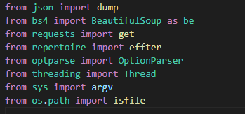
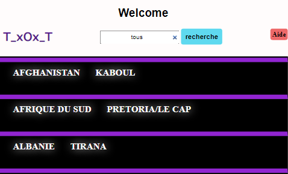

# Country_capital
**country_capital** est un script python de x ligne conçu en 1h par un étudiant qui s'ennuyer un peu cet outil basé sur les donner du site [hors-frontieres](https://hors-frontieres.fr/liste-des-capitales-de-tous-les-pays-du-monde/) ce dernier (le site web) contient un tableau ou liste de tous les pays du monde et leur capital vous vous demandez pourquoi je parle de ce site web en faite pour rien je voulais que la description soit un peu longue maintenant revenons à notre script pour que vous comprenez ce qui se passe dans ce dernier il y a une méthode très répandue qui s'appelle le Web scrapping cette méthode permet d'extraits des donners sur un site web à partir d'un programme et oui vous l'avez compris **country_capital** est conçu pour scrapper les donner du site que je vous présenter au tout début.

# Prérequis
+ `Pyhon`
- `module`<br>

   
  

# Installation
+ ## Window
```window
git clone https://github.com/Tostenn/country_capital.git
cd country_capital
python main.py -a true
```
+ ## Linux 
```bash

git clone https://github.com/Tostenn/country_capital.git
cd country_capital
chmod +x
python main.py -e json

```
# Syntasx
+ Usage
```
main.py -e (json/txt/html) format d'enregistrement des donner
main.py -a affichage des donner (true/false)
main.py -n nom du fichier d'enregistrement par defaut c'est data
main.py -f forcer l'enregistrement dans un fichier exitant
```

+ Exemple
```
main.py -e json -n index -f _
main.py -a false -n data -f _ -e html
main.py -e txt -a true -n enregistrement
```
 + avec le format  `html`<br> 
# **Ce Depot**

> **__Toute amélioration sera la  `BIENVENUE`__** <br>
> **Statut :  `terminer`**
